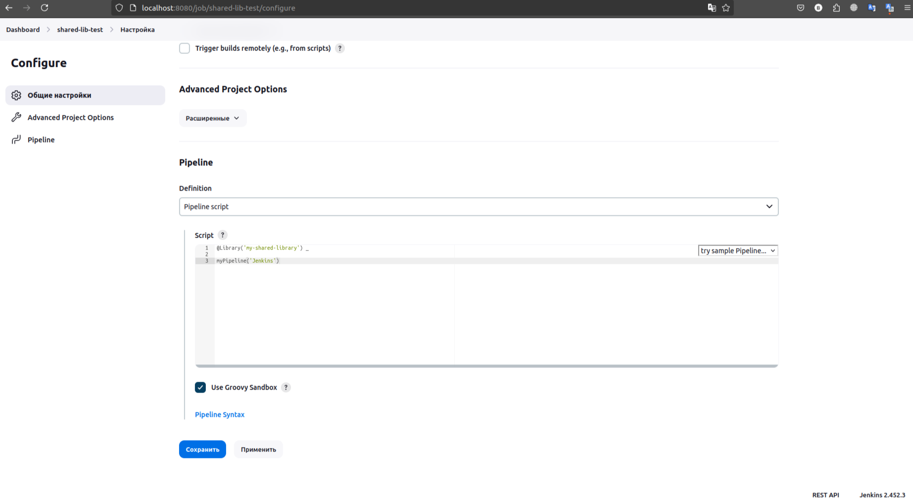

# Применение Shared libraries Jenkins 

Необходимую информацию можно найти на [сайте.](https://www.jenkins.io/doc/book/pipeline/shared-libraries/)

В документации говорится о том, как можно создавать и использовать "Shared Libraries" (общие библиотеки) для автоматизации процессов с помощью Jenkins Pipeline. Это позволяет избежать повторения кода и сделать его более аккуратным и понятным.

**Shared Libraries** - это наборы кода, которые можно использовать в разных проектах Jenkins. Эти библиотеки хранятся в системах контроля версий, таких как Git, и могут быть подключены к любому Pipeline.

## Структура директорий библиотеки 
Библиотека организована следующим образом:
  * src: исходные файлы на языке Groovy.
  * vars: скрипты, которые доступны как глобальные переменные в Pipeline.
  * resources: вспомогательные файлы, например, JSON или XML.

``` bash
(root)
+- src                     # Groovy source files
|   +- org
|       +- foo
|           +- Bar.groovy  # for org.foo.Bar class
+- vars
|   +- foo.groovy          # for global 'foo' variable
|   +- foo.txt             # help for 'foo' variable
+- resources               # resource files (external libraries only)
|   +- org
|       +- foo
|           +- bar.json    # static helper data for org.foo.Bar       +- bar.json
```

Итак, если у вас есть файл с именем vars/log.groovy с такой функцией, как def info(message)…​ в Pipeline вы можете получить доступ к этой функции, например log.info "hello world". В этот файл вы можете поместить столько функций, сколько захотите. Каждый .groovy файл именутся в camelCase стиле.


## Приступим к практике 

### Создадим репозиторий с необходимой структурой 

В командной строке выполним команды:

```bash
mkdir my-shared-library
cd my-shared-library
```

```bash
mkdir -p src/org/foo
mkdir vars
mkdir -p resources/org/foo
```

Создадим скрипт helloWorld.groovy со следующим содержимым:
```bash
nano vars/helloWorld.groovy
```
```
def call(Map config = [:]) {
    sh "echo Hello ${config.name}. Today is ${config.dayOfWeek}"
}
```

Объяснение кода
  * Имя метода: **call** — особое имя метода, позволяющее вызывать его на экземпляре класса или объекта как функцию.
  * Аргументы: **Map config = [:]** — метод принимает один аргумент, который является картой (map) и имеет значение по умолчанию, если карта не передана. Это значит, что если метод вызывается без аргументов, то используется пустая карта.
  * Тело метода: **sh "echo Hello ${config.name}. Today is ${config.dayOfWeek}"** — выполняет команду оболочки (shell command), подставляя значения из карты config.

Инициализируем Git репозиторий:

```bash
git init
```

Добавим все файлы в репозиторий:

```bash
git add .
```

Сделаем первый коммит:

```bash
git commit -m "Initial commit with library structure"
```

Зайдем на GitHub и создадим новый репозиторий (например, shared-lib-jenkins). Далле по инструкции:

```bash
git remote add origin https://github.com/YOUR_USERNAME/shared-lib-jenkins.git
git branch -M main
git push -u origin main
```

### Настроим Jenkins 

Перейдем в настройки системы в Jenkins, почти в самом низу находим настройки связанные с Global Pipeline Libraries и нажимаем добавить:

Даем название нашей будующей библиотеки, в поле Default version указываем ветку в Git (так же можно указать тег, hash коммита...).


Ниже выбираем Modern SCM -> Git и указываем репозиторий. Репозиторий открытый, поэтому credentials указывать не будем.


Создадим Pipeline


Выберем ознокомительный скрипт Hello World, нажмем применить.


Соберем его и перейдем к сборке #1


Посмотрим вывод сборки


Далее изменим скрипт


Аннотация @Library загружает библиотеку и делает её доступной в текущем скрипте Pipeline. Символ _ означает, что весь контент библиотеки будет импортирован в текущий скрипт. Внутри стадии Hello определены шаги (steps), которые должны быть выполнены. В данном случае вызывается метод helloWorld с параметрами dayOfWeek:'Thursday' и name:'Jenkins'

Запустим и посмотрим вывод


**Строка Loading library my-shared-library@main** указывает, что Jenkins загружает общую библиотеку с именем my-shared-library с ветки main. Это происходит благодаря аннотации @Library('my-shared-library') _ в скрипте конвейера.\
**Строка Start of Pipeline** начало выполнения конвейера.\
**Строка Hello Jenkins. Today is Thursday** вывод команды, которая была выполнена в шаге конвейера.


Добавим в библиотеку пару скриптов и сделаем коммит.

```bash
nano src/org/foo/MyUtils.groovy
```


```
package org.foo

class MyUtils {
    static String greet(String name) {
        return "Hello, ${name}!"
    }
}
```

В контексте Jenkins pipeline, часто удобно использовать статические методы в библиотеках для выполнения утилитарных задач. Эти методы можно легко вызвать в любом месте вашего скрипта, без создания объекта.

```bash
nano vars/myPipeline.groovy
```

```
import org.foo.MyUtils

def call(String name) {
    pipeline {
        agent any
        stages {
            stage('Hello') {
                steps {
                    echo MyUtils.greet(name)
                }
            }
        }
    }
}
```

Метод **call** часто используется как точка входа и позволяет упростить синтаксис вызовов.

Изменим pipeline, сохраним и запустим.



Если все сделано правильно, сборка должна быть успешной, можно посмотреть вывод консоли.


В итоге Jenkinsfile сократился, а всю логику можно реализовать в библиотеке.

Пойдем дальше. Дополним наши groovy классы.

```bash
nano src/org/foo/MyUtils.groovy
```

```
package org.foo

class MyUtils {
    public static Script pipeline
    public static String gitUrl = 'https://github.com/Raven988'

    static String greet(String name) {
        return "Hello, ${name}!"
    }

    static String getGitRepoUrl() {
        return pipeline.scm.getUserRemoteConfigs()[0].getUrl()
    }

    static String getGitPath(def originUrl = getGitRepoUrl()) {
        originUrl - gitUrl - '.git'
    }
    
    static String getGitRepoName(def gitRepoUrl = getGitRepoUrl()) {
        String path = getGitPath(gitRepoUrl)
        return path.substring(path.lastIndexOf('/') + 1)
    }

    static void sh(String script, String label=null) {
        pipeline.sh(script: script, label: label)
    }

    static void mkdir(String dir) {
        pipeline.fileOperations([pipeline.folderCreateOperation(dir)])
    }

}
```

  * **public static Script pipeline** - поле хранит объект текущего скрипта Jenkins pipeline, что позволяет вызывать методы Jenkins внутри класса MyUtils;
  * **public static String gitUrl** - поле хранит базовый URL репозитория GitHub, который используется в методах для получения информации о репозитории;
  * **static String greet(String name)** - метод возвращает строку приветствия для указанного имени;
  * **static String getGitRepoUrl()** - метод получает URL текущего репозитория Git из объекта pipeline.scm;
  * **static String getGitPath(def originUrl = getGitRepoUrl())** - метод удаляет базовый URL и суффикс .git из полного URL репозитория, возвращая относительный путь;
  * **static String getGitRepoName(def gitRepoUrl = getGitRepoUrl())** - метод получает имя репозитория из его пути, используя метод getGitPath() и извлекая часть строки после последнего символа;
  * **static void sh(String script, String label = null)** - метод выполняет shell-команду в контексте Jenkins pipeline, используя метод sh объекта pipeline;
  * **static void mkdir(String dir)** - метод создает директорию. Для использования folderCreateOperation требуется установить плагин File Operations в настройках Jenkins.


```bash
nano vars/myPipeline.groovy
```

```
import org.foo.MyUtils

def call(String name) {
    pipeline {
        agent any
        stages {
            stage('Initialize') {
                steps {
                    script {
                        MyUtils.pipeline = this
                    }
                }
            }
            stage('Hello') {
                steps {
                    echo MyUtils.greet(name)
                }
            }
            stage('Example') {
                steps {
                    script {
                        echo MyUtils.getGitRepoName()
                        MyUtils.sh('echo Hello from shell')
                        MyUtils.mkdir('exampleDir')
                    }
                }
            }
        }
    }
}
```

Так же создадим Jenkinsfile

```bash
nano Jenkinsfile
```

```
@Library('my-shared-library') _

myPipeline('Jenkins User')
```

Сдулаем коммит и пуш. В настройках Job укажим Jenkins откуда брать наш Pipeline. Сохраним и запустим.


Посмотрим результат. Если все правильно настроенно, все шаги должны быть выполнены.


В Workspace появиться папка exampleDir.


### Расширяемся
Создадим такую структуру:
```bash
(root)
+- src
|   +- org
|       +- foo
|           +- MyPipeline.groovy
|           +- MyUtils.groovy
|           +- BuildStage.groovy
|           +- TestStage.groovy
|           +- DeployStage.groovy
+- vars
|   +- startPipeline.groovy
+- resources
|   .gitkeep
|Jenkinsfile
```

```
@Library('my-shared-library') _

startPipeline('Jenkins User')
```

```
import org.foo.MyPipeline

def call(String name) {
    MyPipeline pipeline = new MyPipeline(this)

    pipeline.execute(name)
}
```

```
package org.foo

class MyPipeline {

    MyPipeline(pipeline) {
        MyUtils.pipeline = pipeline
    }

    void execute(String name) {
        MyUtils.pipeline.stage('Building') {
            MyUtils.pipeline.echo(BuildStage.build())
        }

        MyUtils.pipeline.stage('Example') {
            MyUtils.pipeline.node {
                MyUtils.pipeline.script {
                    MyUtils.pipeline.echo(MyUtils.greet(name))
                    MyUtils.pipeline.echo(MyUtils.getGitRepoName())
                    MyUtils.sh('echo Hello from shell')
                    MyUtils.mkdir('exampleDir')
                }
            }
        }

        MyUtils.pipeline.stage('Parallel Testing') {
            MyUtils.pipeline.parallel(
                    'Unit Tests': {
                        MyUtils.pipeline.stage('Unit Tests') {
                            MyUtils.pipeline.echo(TestStage.unitTests())
                        }
                    },
                    'Integration Tests': {
                        MyUtils.pipeline.stage('Integration Tests') {
                            MyUtils.pipeline.echo(TestStage.integrationTests())
                        }
                    }
            )
        }

        MyUtils.pipeline.stage('Deploy Stage') {
            MyUtils.pipeline.echo(DeployStage.deploy())
        }
    }
}
```

```
package org.foo

class MyUtils {
    public static Script pipeline
    public static String gitUrl = 'https://github.com/Raven988'

    static String greet(String name) {
        return "Hello, ${name}!"
    }

    static String getGitRepoUrl() {
        return pipeline.scm.getUserRemoteConfigs()[0].getUrl()
    }

    static String getGitPath(def originUrl = getGitRepoUrl()) {
        originUrl - gitUrl - '.git'
    }
    
    static String getGitRepoName(def gitRepoUrl = getGitRepoUrl()) {
        String path = getGitPath(gitRepoUrl)
        return path.substring(path.lastIndexOf('/') + 1)
    }

    static void sh(String script, String label=null) {
        pipeline.sh(script: script, label: label)
    }

    static void mkdir(String dir) {
        pipeline.fileOperations([pipeline.folderCreateOperation(dir)])
    }
}
```


```
package org.foo

class BuildStage {
    static String build() {
        return "Building the project..."
    }
}
```

```
package org.foo

class TestStage {
    static String unitTests() {
        return "Running unit tests..."
    }

    static String integrationTests() {
        return "Running integration tests..."
    }
}
```

```
package org.foo

class DeployStage {
    static String deploy() {
        return "Deploying application..."
    }
}
```


